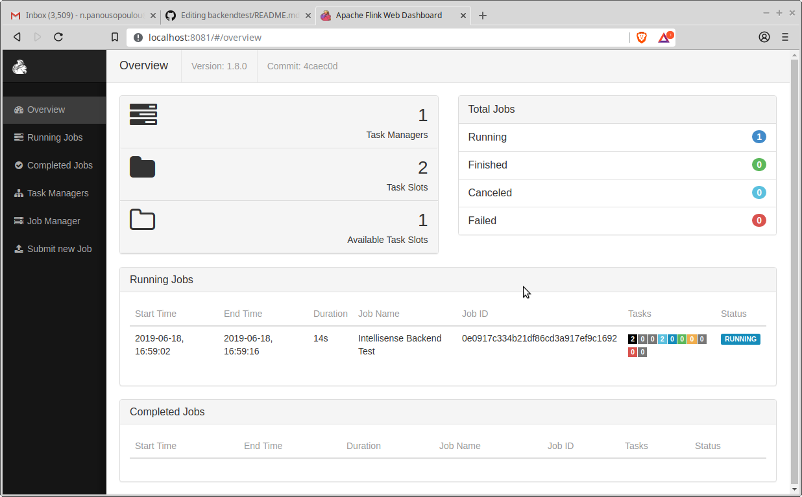

# Streaming timeseries anomaly detection

> Toolbox Author: **Nancy Panousopoulou**  
> Year: **2019**   
> Author Email: [n.panousopoulou@gmail.com](mailto:n.panousopoulou@gmail.com)
> Website: [https://github.com/apanouso/backendtest](https://github.com/apanouso/backendtest)  


## Introduction

This repository contains the Java library for performing streaming timeseries anomaly detection over an Apache Flink-compliant (local) cluster.


The pipeline reads data from the provided file, performs processing to allocate an anomalous score, and then write the data  and corresponding anomaly scores into InfluxDB.  


## Prerequisities

The implementation of the library considers the use of [Apache Flink](https://flink.apache.org), [Apache Maven](https://maven.apache.org) and [InfluxDB Docker](https://hub.docker.com/_/influxdb). 

Specifically, this library has been developed with:

* Linux OS (tested with Ubuntu 16.04.3 LTS) 

* Apache Flink. Tested the version 1.8  for Scala 2.11, available [here](https://flink.apache.org/downloads.html).

* Java JDK / RE . Tested with SE version 1.8.0

* Apache Maven. Tested with version 3.6.1

* Eclipse IDE Oxygen 3 (March 2018 version) and Maven integration software package (v.1.5.0)

Please refer to respective websites for properly installing and configuring the above software packages. A useful guide is available [here](https://ci.apache.org/projects/flink/flink-docs-release-1.8/tutorials/datastream_api.html)

## Compiling the library with Java and Apache Maven.

Download/clone the contents of this folder at a location with read/write/execute permissions. For the purposes of this guide the preselected folder is `/home/user/backendTest`.

* Open the command terminal and go to the library's main directory (e.g. `/home/user/backendTest`).

* Execute the following command:
```bash
$ mvn clean package
```

## Execution

The executable jar file is `backend-test-project-0.1.jar`, located under the `target` directory. 

### Execution parameters.

The jar accepts the following input parameters:

* `--input`: the absolute path to the CSV file with the sensors measurements. This is a required input parameter.

* `--dbname`: the InfluxDB name for writing the results. The Influx database should be created prior the execution of the program. This is a required input parameter.

* `--window`: the size of the window for perfoming anomaly detection. Default value for this parameter is set to `100`.

* `--method`: the method employed for anomaly detection. Currenlty to methods are supported: (a) `default` corresponds to the method provided by test description, (b) `tukey` corresponds to Tukey's algorithm for IQR-based outliers detection. Default value for this parameter is set to `default`.


### 	Execution over a Flink cluster

* Open a new command terminal and start the flink cluster with the following command:
```bash
$ $FLINK/bin/start-cluster.sh
```
$FLINK is the location of Apache Flink prebuild files (e.g., '/usr/local/flink')

* Load the InfluxDB service, e.g., through Docker using:

```bash
sudo docker run -p 8086:8086 -p 8083:8083 -e INFLUXDB_ADMIN_ENABLED=true -v $PWD:/var/lib/influxdb influxdb
```

* Create the database (e.g., `mytestdb`): 
```bash
curl -i -POST http://localhost:8086/query --data-urlencode "q=CREATE DATABASE mytestdb"
```

* Go to the master directory (`/home/user/backendTest`) and execute:
```bash
./$FLINK/bin/flink run target/backend-test-project-0.1.jar --input <Path to CSV FILE> --dbname mytestdb --window 100 --method tukey
```


To check whether the launch of the application is successful open an internet browser and type `localhost:8081/'




* The results are written in the database using the following schema:

[{"name":"measurements","columns":["time","anomalyScore","sensorId","value"], e.g.
[2017-01-01T00:00:00Z, "0.5", "1","215.304292299079"]


* For shutting down the cluster: Open a command terminal and type:

```bash
$ $FLINK/sbin/stop-cluster.sh
```
